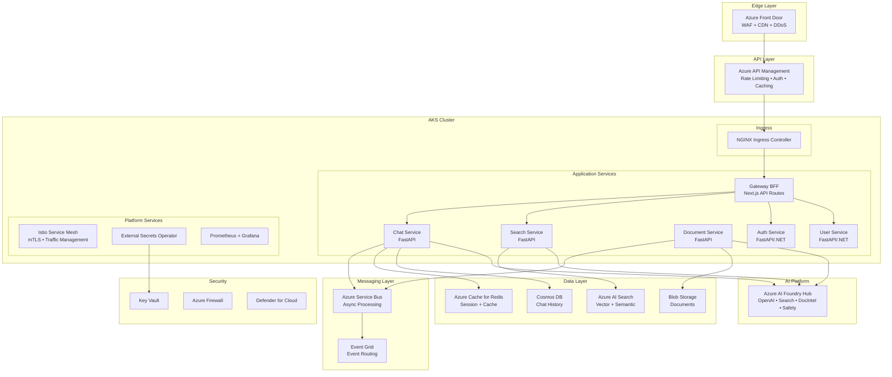
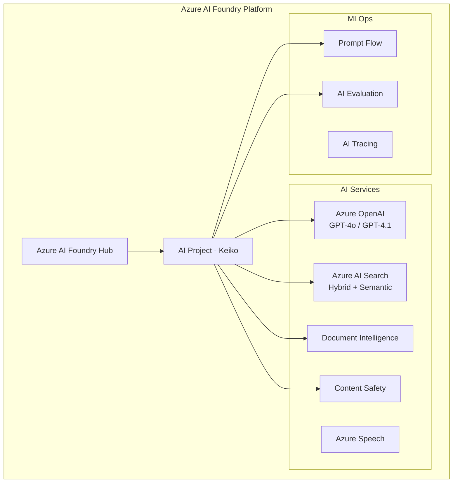
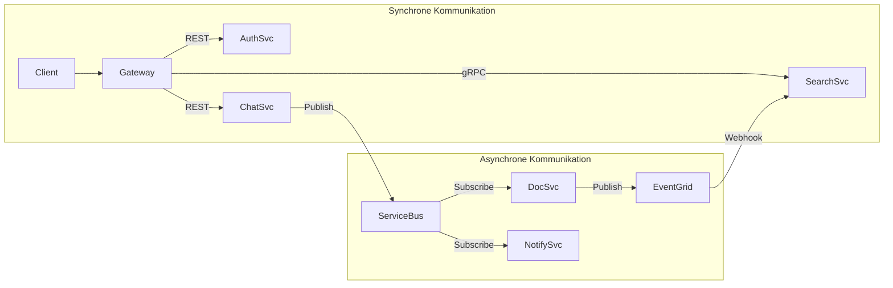
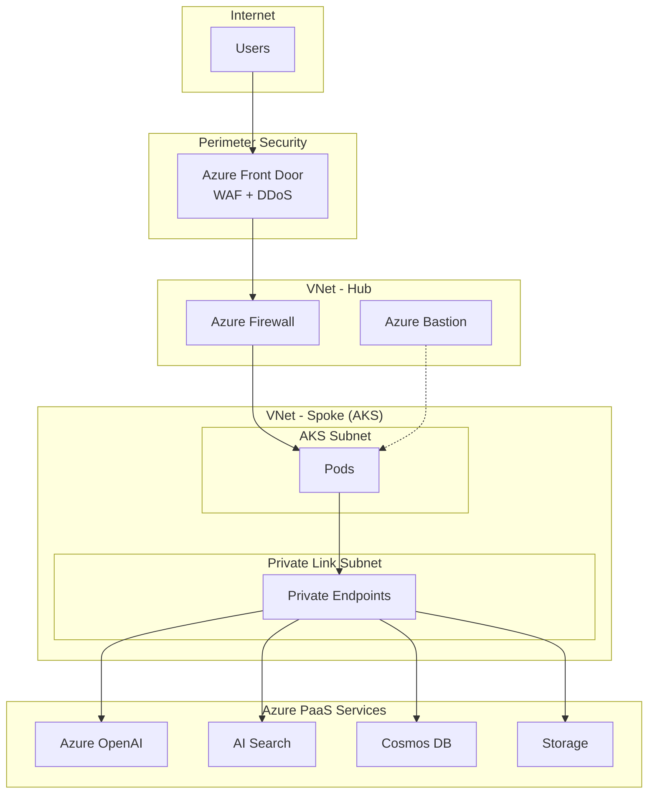
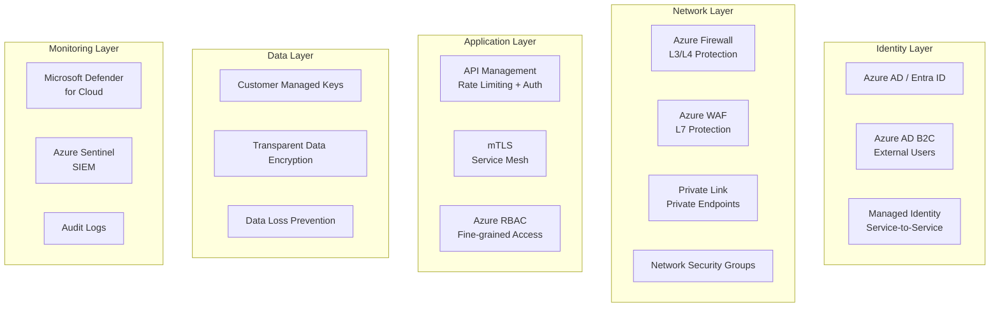
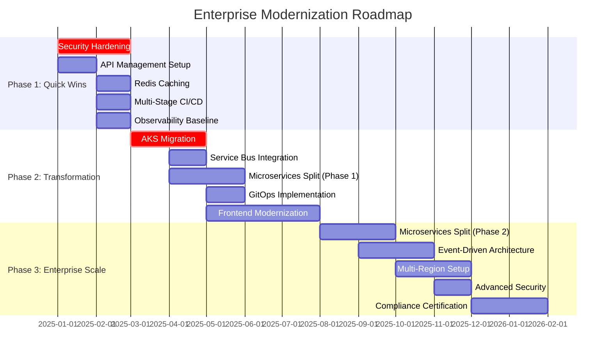
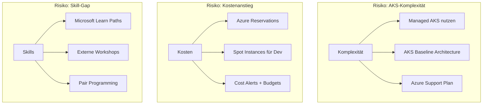

# Enterprise-Architektur-Analyse: Keiko Personal Assistant

**Version:** 1.0 (Final)  
**Datum:** 2025-12-18  
**Status:** Konsolidierte Endfassung  
**Plattform:** Microsoft Azure AI Foundry

---

## Inhaltsverzeichnis

1. [Executive Summary](#1-executive-summary)
2. [Aktuelle Architektur (IST-Zustand)](#2-aktuelle-architektur-ist-zustand)
3. [Gap-Analyse (IST vs. SOLL)](#3-gap-analyse-ist-vs-soll)
4. [Ziel-Architektur (SOLL-Zustand)](#4-ziel-architektur-soll-zustand)
5. [Microservices-Dekomposition](#5-microservices-dekomposition)
6. [Cloud-Native Azure Architektur](#6-cloud-native-azure-architektur)
7. [Frontend-Modernisierung](#7-frontend-modernisierung)
8. [Backend-Modernisierung](#8-backend-modernisierung)
9. [Security & Compliance](#9-security--compliance)
10. [DevOps & CI/CD](#10-devops--cicd)
11. [Kosten & ROI](#11-kosten--roi)
12. [Modernisierungs-Roadmap](#12-modernisierungs-roadmap)
13. [Risiken & Mitigation](#13-risiken--mitigation)
14. [Success Metrics (KPIs)](#14-success-metrics-kpis)
15. [Nächste Schritte](#15-nächste-schritte)
16. [Anhang](#16-anhang)

---

## 1. Executive Summary

### Projektziel

Transformation des **Keiko Personal Assistant** von einer funktionalen Demo-Anwendung zu einer **produktionsreifen, skalierbaren Enterprise-Lösung** auf Basis von **Microsoft Azure AI Foundry**.

### Kernbefunde

| Bereich | Aktueller Status | Zielstatus | Priorität |
|---------|------------------|------------|-----------|
| **Infrastruktur** | Container Apps (Consumption) | AKS mit Enterprise-Features | Hoch |
| **Architektur** | Monolith | Microservices (5-6 Services) | Hoch |
| **Frontend** | React 18 + Fluent UI + Vite | Next.js 15 + shadcn/ui + Tailwind | Mittel |
| **Backend** | Python/Quart | FastAPI + Event-Driven | Hoch |
| **Security** | Basis-Auth + optionale Private Endpoints | Zero Trust Architecture | Kritisch |
| **CI/CD** | Single-Stage GitHub Actions | Multi-Stage mit GitOps | Hoch |
| **Observability** | Application Insights (Basis) | Full-Stack Observability | Mittel |

### Kern-Empfehlung

> **"Refactor to Microservices on AKS"**
>
> Migration von der monolithischen Python-App zu einer dedizierten Microservices-Architektur auf **Azure Kubernetes Service (AKS)**, orchestriert via **GitOps (Flux)**.

### Investitionsübersicht

| Szenario | Infrastrukturkosten/Monat | Aufwand | Empfehlung |
|----------|---------------------------|---------|------------|
| **A: Optimiert** | €735–1.235 | 3–6 Monate | ⭐ **Empfohlen für Start** |
| **B: Standard** | €1.365–2.165 | 6–12 Monate | Bei >200 Usern |
| **C: Premium** | €4.600–5.850 | 12–18 Monate | Enterprise/Compliance |

**Team-Größe:** 2–4 Entwickler + 1 DevOps Engineer (Szenario A/B)

---

## 2. Aktuelle Architektur (IST-Zustand)

### 2.1 Technologie-Stack

```
┌─────────────────────────────────────────────────────────────────┐
│                        FRONTEND                                  │
├─────────────────────────────────────────────────────────────────┤
│  React 18.3 │ TypeScript │ Vite 6.0 │ Fluent UI 8.x/9.x │ MSAL │
│  react-router-dom 6.28 │ i18next (9 Sprachen)                   │
└─────────────────────────────────────────────────────────────────┘
                              │
                              ▼
┌─────────────────────────────────────────────────────────────────┐
│                        BACKEND                                   │
├─────────────────────────────────────────────────────────────────┤
│  Python 3.11 │ Quart (async) │ Gunicorn │ OpenTelemetry        │
│  azure-search-documents │ openai │ azure-identity              │
└─────────────────────────────────────────────────────────────────┘
                              │
                              ▼
┌─────────────────────────────────────────────────────────────────┐
│                     AZURE SERVICES                               │
├─────────────────────────────────────────────────────────────────┤
│  Azure OpenAI (GPT-4.1-mini) │ Azure AI Search │ Doc Intel     │
│  Blob Storage │ CosmosDB (optional) │ Application Insights     │
│  Container Apps / App Service │ Azure Functions                │
└─────────────────────────────────────────────────────────────────┘
```

### 2.2 Infrastruktur-Komponenten

| Komponente | Aktuelle Konfiguration | Bewertung |
|------------|------------------------|-----------|
| **Compute** | Container Apps (Consumption) oder App Service | ⚠️ Begrenzte Skalierung |
| **Networking** | Optional: VNet + Private Endpoints | ⚠️ Nicht enforced |
| **Storage** | Standard_LRS | ⚠️ Keine Geo-Redundanz |
| **Search** | Basic SKU, Free Semantic Ranker | ⚠️ Produktionslimits |
| **OpenAI** | 30K TPM Default | ⚠️ Kapazitätsgrenzen |
| **Monitoring** | Application Insights | ✅ Grundlegend vorhanden |
| **IaC** | Bicep (modular) | ✅ Gut strukturiert |
| **AI Foundry** | Hub + Project provisioniert | ⚠️ Nicht als zentrale Plattform genutzt |

### 2.3 Stärken

1. ✅ **Solide Azure-Integration:** Native Nutzung von Azure AI Services
2. ✅ **Modulare Bicep-Templates:** Gut strukturierte Infrastructure as Code
3. ✅ **Private Endpoint Support:** Netzwerkisolation vorbereitet
4. ✅ **OpenTelemetry-Instrumentierung:** Distributed Tracing vorhanden
5. ✅ **Flexible Deployment-Optionen:** Container Apps oder App Service
6. ✅ **Internationalisierung:** i18next mit 9 Sprachen

### 2.4 Schwächen

1. ❌ **Monolithische Struktur:** Backend als einzelne Anwendung
2. ❌ **Keine API-Gateway-Schicht:** Fehlende zentrale API-Verwaltung
3. ❌ **Begrenzte Skalierbarkeit:** Consumption-Tier Limits, Cold Starts
4. ❌ **Keine Event-Driven Architecture:** Synchrone Verarbeitung
5. ❌ **Fehlende Caching-Strategie:** Keine Redis-Integration
6. ❌ **Basis-CI/CD:** Keine Approval Gates, kein GitOps
7. ❌ **Frontend Tech Debt:** Mix aus Fluent UI v8 und v9

---

## 3. Gap-Analyse (IST vs. SOLL)

### 3.1 Kritische Gaps

| ID | Bereich | IST | SOLL | Priorität |
|----|---------|-----|------|-----------|
| **G1** | Container-Orchestrierung | Container Apps (Consumption) | AKS mit Workload Identity | 🔴 P0 |
| **G2** | API Gateway | Keins | Azure API Management | 🔴 P0 |
| **G3** | Network Security | Private Endpoints (optional) | Zero Trust + Azure Firewall | 🔴 P0 |
| **G4** | Service-Granularität | Monolith | 5–6 Microservices | 🔴 P1 |
| **G5** | Event-Driven | Synchron | Azure Service Bus + Event Grid | 🔴 P1 |
| **G6** | Caching | Keins | Azure Cache for Redis | 🔴 P1 |
| **G7** | Rate Limiting | Keins | API Management + Redis | 🔴 P1 |
| **G8** | Pipeline Stages | Single-Stage | Multi-Stage (Dev→Staging→Prod) | 🔴 P1 |
| **G9** | Container Security | Keins | Defender for Containers + Trivy | 🔴 P1 |
| **G10** | Frontend Framework | React 18 (CSR) | Next.js 15 (SSR/RSC) | 🟡 P2 |
| **G11** | Backend Framework | Quart | FastAPI | 🟡 P2 |
| **G12** | State Management | React Context | Zustand + TanStack Query | 🟡 P2 |
| **G13** | GitOps | Keins | Flux CD oder ArgoCD | 🟡 P2 |
| **G14** | Service Mesh | Keins | Istio oder Linkerd | 🟡 P2 |
| **G15** | Multi-Region | Single Region | Active-Active Multi-Region | 🟢 P3 |

### 3.2 AI Foundry Integration Gap

| Aspekt | IST | SOLL |
|--------|-----|------|
| **Modell-Lifecycle** | Direkte OpenAI-Aufrufe | Zentrale Foundry Deployments |
| **Prompt-Management** | Im Code | Foundry Prompt Flow |
| **Safety-Richtlinien** | Basis Content Filter | Zentrale Responsible AI Policies |
| **Evaluation** | Manuell | Foundry AI Evaluation |
| **Environment-Konzept** | Keins | Dev/Test/Prod mit Freigabeprozessen |

---

## 4. Ziel-Architektur (SOLL-Zustand)

### 4.1 Enterprise Target Architecture



### 4.2 Azure AI Foundry Integration



**Empfehlungen für AI Foundry:**
- Klare Trennung von **App-spezifischer Logik** und **Modell-/Prompt-Konfiguration** in Foundry
- Einführung von **Environment-Konzepten** (Dev/Test/Prod) mit expliziten Freigabeprozessen
- Zentrale **Responsible AI Policies** und **Content Filtering** in Foundry definieren

---

## 5. Microservices-Dekomposition

### 5.1 Service-Katalog

| Service | Technologie | Verantwortlichkeit | Datenbank | APIs |
|---------|-------------|-------------------|-----------|------|
| **Gateway BFF** | Next.js API Routes | Aggregation, UI-spezifische Transformation | - | REST |
| **Chat Service** | FastAPI | Konversationslogik, LLM-Aufrufe, Streaming | Cosmos DB | REST, WebSocket |
| **Search Service** | FastAPI | RAG-Retrieval, Embedding-Suche, Ranking | - (AI Search) | REST, gRPC |
| **Document Service** | FastAPI | Upload, Parsing, Chunking, Indexierung | Cosmos DB (Jobs) | REST, Events |
| **Auth Service** | FastAPI/.NET | Authentifizierung, Token-Management | - (Entra ID) | REST, gRPC |
| **User Service** | FastAPI/.NET | Benutzerprofil, Präferenzen, Access Control | Cosmos DB | REST |

### 5.2 Service-Kommunikation



### 5.3 Kommunikationsmuster

| Muster | Protokoll | Use Case |
|--------|-----------|----------|
| **Extern (North-South)** | REST + JSON | Client → API Gateway → Services |
| **Intern synchron (East-West)** | gRPC | Service-to-Service (hohe Performance) |
| **Intern asynchron** | Azure Service Bus | Commands, Events, Batch-Jobs |
| **System-Events** | Event Grid | Blob-Events, Lifecycle-Events |

### 5.4 Daten- und Persistenzmuster

- **Database per Service:** Jeder Service verwaltet seine eigene Datenbank
- **CQRS:** Schreibmodell (Ingestion) getrennt vom Lesemodell (Search-Index)
- **Event Sourcing:** Optional für regulatorisch relevante Konversationen

---

## 6. Cloud-Native Azure Architektur

### 6.1 Container Apps vs. AKS

| Kriterium | Container Apps | AKS | Empfehlung |
|-----------|----------------|-----|------------|
| **Enterprise Control** | ⚠️ Limitiert | ✅ Vollständig | AKS |
| **Service Mesh** | ❌ Nicht unterstützt | ✅ Istio, Linkerd | AKS |
| **Networking** | ⚠️ Eingeschränkt | ✅ Flexible CNI, Network Policies | AKS |
| **Multi-Region** | ⚠️ Komplex | ✅ Native Support | AKS |
| **Kosten (klein)** | ✅ Günstiger | ⚠️ Teurer | Container Apps |
| **Kosten (groß)** | ⚠️ Teurer | ✅ Günstiger (Reserved) | AKS |
| **GitOps** | ⚠️ Limitiert | ✅ Flux, ArgoCD | AKS |
| **Ops-Aufwand** | ✅ Gering | ⚠️ Höher | Container Apps |

**Empfehlung:**
- **Dev/PoC:** Azure Container Apps (schnelle Iteration, geringer Ops-Aufwand)
- **Produktion:** Azure Kubernetes Service (Enterprise-Features, volle Kontrolle)

### 6.2 AKS Konfiguration

```yaml
Cluster:
  Name: keiko-aks-prod
  Version: 1.29+
  Region: West Europe
  Availability Zones: [1, 2, 3]

Node Pools:
  system:
    VM Size: Standard_D4s_v5
    Node Count: 3
    Auto-Scaling: true (min: 3, max: 10)

  workload:
    VM Size: Standard_D8s_v5
    Node Count: 3
    Auto-Scaling: true (min: 3, max: 20)

  spot:
    VM Size: Standard_D8s_v5
    Spot: true
    Auto-Scaling: true (min: 0, max: 10)

Networking:
  Network Plugin: Azure CNI Overlay
  Network Policy: Calico

Add-ons:
  - Azure Monitor Container Insights
  - Azure Key Vault CSI Driver
  - KEDA (Event-Driven Autoscaling)
  - Workload Identity
```

### 6.3 Service Mesh (Istio)

**Features:**
- ✅ Mutual TLS (mTLS) zwischen allen Services
- ✅ Traffic Management (Canary, A/B Testing)
- ✅ Circuit Breaking & Retry Policies
- ✅ Distributed Tracing (Jaeger)
- ✅ Metrics (Prometheus, Grafana)

### 6.4 Network Security



**Security Features:**
- ✅ Private Endpoints für alle PaaS Services
- ✅ Network Security Groups (NSGs)
- ✅ Azure Firewall für Egress Traffic
- ✅ DDoS Protection Standard
- ✅ Web Application Firewall (WAF)

---

## 7. Frontend-Modernisierung

### 7.1 Empfohlener Stack

| Komponente | Aktuell | Empfohlen | Begründung |
|------------|---------|-----------|------------|
| **Framework** | React 18 + Vite | Next.js 15 (App Router) | SSR, RSC, API Routes, bessere Performance |
| **UI Library** | Fluent UI 8.x/9.x | shadcn/ui + Radix UI | Moderne Komponenten, Tailwind-basiert, Accessibility |
| **Styling** | CSS-in-JS | Tailwind CSS v4 | Performance, Utility-First |
| **State (Server)** | fetch + useState | TanStack Query v5 | Caching, Optimistic Updates |
| **State (Client)** | React Context | Zustand | Einfacher, performanter |
| **Forms** | Manuell | React Hook Form + Zod | Validation, TypeScript |
| **i18n** | i18next | next-intl | Next.js native Integration |
| **Auth** | MSAL Browser | MSAL + NextAuth | Server-side Session |

### 7.2 Next.js App Struktur

```
app/
├── (auth)/
│   ├── login/
│   └── logout/
├── (dashboard)/
│   ├── chat/
│   │   ├── page.tsx          # Server Component
│   │   └── chat-interface.tsx # Client Component
│   ├── history/
│   └── upload/
├── api/
│   ├── chat/route.ts         # API Route (Proxy)
│   └── upload/route.ts
├── layout.tsx                 # Root Layout
└── providers.tsx              # Client Providers
```

### 7.3 Performance-Optimierungen

- ✅ **React Server Components** für initial page load
- ✅ **Streaming SSR** für Chat-Antworten
- ✅ **Partial Prerendering** (Next.js 15)
- ✅ **Image Optimization** (next/image)
- ✅ **Code Splitting** automatisch
- ✅ **PWA-Fähigkeiten** (Offline-Modus, Installierbarkeit)

### 7.4 UI/UX Best Practices

```typescript
// Moderne shadcn/ui + Radix Komponenten
import { Button } from "@/components/ui/button"
import { Card } from "@/components/ui/card"

// Accessibility-first
<Button
  variant="primary"
  size="lg"
  aria-label="Send message"
  disabled={loading}
>
  Send
</Button>

// Dark Mode support
<ThemeProvider defaultTheme="system">
  <App />
</ThemeProvider>
```

---

## 8. Backend-Modernisierung

### 8.1 Empfohlener Stack

| Komponente | Aktuell | Empfohlen | Begründung |
|------------|---------|-----------|------------|
| **Framework** | Quart | FastAPI | Bessere Performance, auto OpenAPI |
| **Async Runtime** | asyncio | asyncio + uvloop | 2–3x Performance |
| **API Spec** | Manuell | Pydantic v2 + OpenAPI 3.1 | Auto-Generierung, Validation |
| **Caching** | Keins | Redis + Cachetools | Session, Response, Embedding Cache |
| **Background Jobs** | Azure Functions | Celery + Redis / KEDA | Skalierbar, Monitoring |
| **Resilience** | Keins | Tenacity + Circuit Breaker | Retry, Fallback |
| **AI Framework** | openai SDK | Semantic Kernel | Standardisierte Abstraktion |

### 8.2 FastAPI Service Template

```python
from fastapi import FastAPI, Depends
from fastapi.middleware.cors import CORSMiddleware
from opentelemetry.instrumentation.fastapi import FastAPIInstrumentor
from azure.identity.aio import DefaultAzureCredential
from azure.monitor.opentelemetry import configure_azure_monitor

# Observability
configure_azure_monitor()

app = FastAPI(
    title="Chat Service",
    version="2.0.0",
    docs_url="/api/docs"
)

# Instrumentation
FastAPIInstrumentor.instrument_app(app)

# CORS
app.add_middleware(
    CORSMiddleware,
    allow_origins=["https://keiko.azurefd.net"],
    allow_credentials=True,
    allow_methods=["*"],
    allow_headers=["*"],
)

# Dependency Injection
async def get_openai_client():
    credential = DefaultAzureCredential()
    return AsyncOpenAI(
        azure_endpoint=os.getenv("AZURE_OPENAI_ENDPOINT"),
        azure_ad_token_provider=get_bearer_token_provider(
            credential, "https://cognitiveservices.azure.com/.default"
        )
    )

# Endpoints mit Type Safety
@app.post("/api/chat", response_model=ChatResponse)
async def chat(
    request: ChatRequest,
    openai_client: AsyncOpenAI = Depends(get_openai_client),
    user: User = Depends(get_current_user)
) -> ChatResponse:
    # Business Logic
    pass

# Health Checks
@app.get("/health/live")
async def liveness():
    return {"status": "ok"}

@app.get("/health/ready")
async def readiness():
    return {"status": "ready"}
```

### 8.3 Caching-Strategie

```python
CACHE_LAYERS = {
    "l1_memory": {
        "type": "cachetools.TTLCache",
        "ttl": 60,  # 1 Minute
        "use_case": "Hot data, Embeddings"
    },
    "l2_redis": {
        "type": "Azure Cache for Redis",
        "ttl": 3600,  # 1 Stunde
        "use_case": "Session, Search Results"
    },
    "l3_cosmos": {
        "type": "Cosmos DB",
        "ttl": 86400,  # 24 Stunden
        "use_case": "Chat History, User Preferences"
    }
}
```

### 8.4 API Design Patterns

**REST APIs (North-South Traffic):**
- ✅ OpenAPI 3.1 Specification
- ✅ Versioning via URL (`/api/v1/chat`)
- ✅ Pagination, Filtering, Sorting
- ✅ Rate Limiting (Azure API Management)

**gRPC (East-West Traffic):**
- ✅ High Performance Binary Protocol
- ✅ Strong Typing mit Protobuf
- ✅ Bidirectional Streaming
- ✅ Native Load Balancing

---

## 9. Security & Compliance

### 9.1 Zero Trust Architecture



### 9.2 Security Controls

| Control | Status | Aktion |
|---------|--------|--------|
| ✅ Managed Identity | Vorhanden | Erweitern auf alle Services |
| ✅ Private Endpoints | Optional | Mandatory für Produktion |
| ⚠️ Azure Firewall | Nicht vorhanden | Implementieren |
| ⚠️ WAF | Nicht vorhanden | Azure Front Door WAF |
| ⚠️ Container Scanning | Nicht vorhanden | Defender for Containers + Trivy |
| ⚠️ Secret Rotation | Manuell | Automatisieren mit Key Vault |
| ❌ SIEM Integration | Nicht vorhanden | Azure Sentinel |
| ❌ DDoS Protection | Nicht vorhanden | Azure DDoS Standard |

### 9.3 Secrets Management

```yaml
# Azure Key Vault CSI Driver
apiVersion: secrets-store.csi.x-k8s.io/v1
kind: SecretProviderClass
metadata:
  name: keiko-secrets
spec:
  provider: azure
  parameters:
    keyvaultName: "keiko-kv-prod"
    useVMManagedIdentity: "true"
    objects: |
      array:
        - objectName: "openai-api-key"
          objectType: "secret"
        - objectName: "cosmos-connection-string"
          objectType: "secret"
```

### 9.4 Compliance & Governance

**Frameworks:**
- ✅ **GDPR** – EU Data Protection Regulation
- ✅ **SOC 2 Type II** – Security, Availability, Confidentiality
- ✅ **ISO 27001** – Information Security Management

**Data Encryption:**

| Layer | Encryption | Key Management |
|-------|------------|----------------|
| **At Rest** | Azure Storage Encryption (SSE) | Microsoft-Managed oder CMK |
| **In Transit** | TLS 1.3 | Certificates in Key Vault |
| **Application** | Field-Level Encryption | Key Vault Managed HSM |

---

## 10. DevOps & CI/CD

### 10.1 Multi-Stage Pipeline

```mermaid
graph LR
    subgraph "Build Stage"
        Code[Source Code] --> Lint[Linting]
        Lint --> Test[Unit Tests]
        Test --> SAST[SAST Scan]
        SAST --> Build[Container Build]
        Build --> Scan[Container Scan]
        Scan --> Push[Push to ACR]
    end

    subgraph "Deploy Stages"
        Push --> Dev[Dev Environment]
        Dev --> IntTest[Integration Tests]
        IntTest --> Staging[Staging Environment]
        Staging --> DAST[DAST Scan]
        DAST --> Approval{Manual Approval}
        Approval --> Prod[Production]
    end

    subgraph "Post-Deploy"
        Prod --> Smoke[Smoke Tests]
        Smoke --> Monitor[Monitoring]
        Monitor --> Rollback{Issues?}
        Rollback -->|Yes| Revert[Auto-Rollback]
    end
```



### 10.2 GitOps mit Flux

```yaml
# Empfohlene GitOps-Struktur
├── clusters/
│   ├── dev/
│   │   └── flux-system/
│   ├── staging/
│   │   └── flux-system/
│   └── production/
│       └── flux-system/
├── infrastructure/
│   ├── base/
│   │   ├── ingress-nginx/
│   │   ├── cert-manager/
│   │   └── external-secrets/
│   └── overlays/
│       ├── dev/
│       ├── staging/
│       └── production/
└── apps/
    ├── base/
    │   ├── chat-service/
    │   ├── search-service/
    │   └── document-service/
    └── overlays/
        ├── dev/
        ├── staging/
        └── production/
```

### 10.3 Deployment-Strategien

| Strategie | Use Case | Risiko | Rollback-Zeit |
|-----------|----------|--------|---------------|
| **Rolling Update** | Standard-Deployments | Niedrig | 2–5 Min |
| **Blue-Green** | Major Releases | Sehr niedrig | < 1 Min |
| **Canary** | Feature Releases | Niedrig | < 1 Min |
| **A/B Testing** | UX-Experimente | Niedrig | Sofort |

### 10.4 GitHub Actions Workflow

```yaml
name: Production Deployment

on:
  push:
    branches: [main]

env:
  REGISTRY: keikoacr.azurecr.io
  AKS_CLUSTER: keiko-aks-prod

jobs:
  build-and-test:
    runs-on: ubuntu-latest
    steps:
      - uses: actions/checkout@v4
      - name: Run Tests
        run: pytest --cov=app

  security-scan:
    runs-on: ubuntu-latest
    steps:
      - name: Run Trivy Scan
        uses: aquasecurity/trivy-action@master
        with:
          scan-type: 'fs'
          severity: 'CRITICAL,HIGH'

  build-push:
    needs: [build-and-test, security-scan]
    runs-on: ubuntu-latest
    steps:
      - name: Build and Push
        run: |
          docker build -t ${{ env.REGISTRY }}/chat-service:${{ github.sha }} .
          docker push ${{ env.REGISTRY }}/chat-service:${{ github.sha }}

  deploy-staging:
    needs: build-push
    environment: staging
    steps:
      - name: Deploy to AKS Staging
        uses: azure/k8s-deploy@v4

  deploy-production:
    needs: deploy-staging
    environment: production
    steps:
      - name: Canary Deployment
        uses: azure/k8s-deploy@v4
        with:
          strategy: canary
          percentage: 20
```

---

## 11. Kosten & ROI

### 11.1 Aktuelle Kosten (Baseline)

| Service | SKU | Monatliche Kosten (€) |
|---------|-----|----------------------|
| Container Apps | Consumption | 50–150 |
| Azure OpenAI | 30K TPM | 100–400 |
| Azure AI Search | Basic | 70 |
| Blob Storage | Standard_LRS | 20 |
| Document Intelligence | S0 | 50 |
| Application Insights | Pay-as-you-go | 20 |
| **Gesamt (aktuell)** | | **310–710** |

### 11.2 Drei Upgrade-Szenarien

#### 🟢 Szenario A: Optimierte Produktion (Empfohlen für Start)

**Ziel:** Produktionsreif mit minimalen Mehrkosten

| Service | Änderung | Monatliche Kosten (€) |
|---------|----------|----------------------|
| Container Apps | Dedicated D4 | 150–250 |
| Azure OpenAI | 50K TPM | 200–600 |
| Azure AI Search | Standard | 230 |
| Blob Storage | Standard_ZRS | 30 |
| Azure Cache for Redis | Basic C0 | 15 |
| API Management | Developer | 45 |
| Private Endpoints | 5x essenzielle | 35 |
| Application Insights | Pay-as-you-go | 30 |
| **Gesamt Szenario A** | | **735–1.235** |
| **Mehrkosten vs. Aktuell** | | **+425–525 (+60–75%)** |

**Was Sie bekommen:**
- ✅ Produktions-SLA (99.9%)
- ✅ Caching für bessere Performance
- ✅ Geo-redundanter Storage
- ✅ Private Endpoints für kritische Services
- ✅ API Gateway mit Rate Limiting

---

#### 🟡 Szenario B: Enterprise Standard

**Ziel:** Vollständige Enterprise-Features ohne Overkill

| Service | Änderung | Monatliche Kosten (€) |
|---------|----------|----------------------|
| Container Apps | Dedicated D8 + Auto-Scale | 300–400 |
| Azure OpenAI | 100K TPM | 400–1.000 |
| Azure AI Search | Standard S1 | 230 |
| Blob Storage | Standard_ZRS | 40 |
| Azure Cache for Redis | Standard C1 | 90 |
| API Management | Basic | 140 |
| Azure Service Bus | Standard | 10 |
| Private Endpoints | 8x | 55 |
| Cosmos DB | Serverless | 50–150 |
| Application Insights + Alerts | Enhanced | 50 |
| **Gesamt Szenario B** | | **1.365–2.165** |
| **Mehrkosten vs. Aktuell** | | **+1.055–1.455 (+150–200%)** |

**Was Sie zusätzlich bekommen:**
- ✅ Async Processing (Service Bus)
- ✅ Chat History Persistence
- ✅ Besseres Caching (Redis Standard)
- ✅ Höhere API-Kapazität

---

#### 🔴 Szenario C: Enterprise Premium (AKS)

**Ziel:** Maximale Kontrolle, Multi-Region, Compliance

| Service | Änderung | Monatliche Kosten (€) |
|---------|----------|----------------------|
| AKS | 3x D4s_v3 | 350–500 |
| Azure OpenAI | 150K TPM | 600–1.500 |
| Azure AI Search | Standard S2 | 460 |
| Blob Storage | Standard_GZRS | 60 |
| Azure Cache for Redis | Premium P1 | 380 |
| API Management | Standard | 650 |
| Azure Service Bus | Premium | 680 |
| Azure Front Door | Standard | 35 |
| Azure Firewall | Standard | 850 |
| Cosmos DB | Provisioned | 200–400 |
| Private Endpoints | 12x | 85 |
| Defender for Cloud | Full | 100 |
| Log Analytics | Enhanced | 150 |
| **Gesamt Szenario C** | | **4.600–5.850** |
| **Mehrkosten vs. Aktuell** | | **+4.290–5.140 (+600–700%)** |

**Wann Szenario C?**
- 🏢 >1000 gleichzeitige Benutzer
- 🔒 Strenge Compliance (SOC 2, ISO 27001)
- 🌍 Multi-Region Anforderung
- 🎛️ Volle Kubernetes-Kontrolle benötigt

### 11.3 Kostenvergleich Übersicht

```
Monatliche Kosten (€)
│
│  5.850 ┤                              ████████ Szenario C (Premium)
│  4.600 ┤                              ████████
│        │
│  2.165 ┤                    ████████ Szenario B (Standard)
│  1.365 ┤                    ████████
│        │
│  1.235 ┤          ████████ Szenario A (Optimiert) ⭐ EMPFOHLEN
│    735 ┤          ████████
│        │
│    710 ┤ ████████ Aktuell
│    310 ┤ ████████
│        │
└────────┴──────────────────────────────────────────────────────
```

### 11.4 Cost Optimization Strategien

| Strategie | Einsparung | Anwendbar auf |
|-----------|------------|---------------|
| **Azure Reservations (1 Jahr)** | 20–35% | Compute, Redis, Cosmos |
| **Azure Reservations (3 Jahre)** | 40–60% | Compute, Redis, Cosmos |
| **Spot Instances für Dev/Test** | 60–90% | Nicht-Prod Umgebungen |
| **Auto-Scaling (Scale-to-Zero)** | 30–50% | Dev/Test Container Apps |
| **Prompt-Optimierung** | 20–40% | OpenAI Token-Kosten |
| **Caching** | 30–50% | Wiederholte Queries |

### 11.5 ROI-Betrachtung

| Faktor | Szenario A | Szenario B | Szenario C |
|--------|------------|------------|------------|
| **Verfügbarkeit SLA** | 99.9% | 99.95% | 99.99% |
| **Max. Concurrent Users** | ~200 | ~500 | ~5000+ |
| **Response Time (p95)** | <500ms | <200ms | <100ms |
| **Recovery Time (RTO)** | 4h | 1h | 15min |
| **Compliance Ready** | Basic | Standard | Full |

### 11.6 ROI-Kalkulation (3 Jahre)

**Investition (Szenario B):**
- Initial Setup: €50.000 (Development, Migration)
- Jährliche Infra: €26.000 (Mittelwert)
- **Total (3 Jahre): €128.000**

**Einsparungen & Benefits:**
- Entwickler-Produktivität: +30% → €200.000/Jahr
- Operational Efficiency: -50% Manual Work → €100.000/Jahr
- Reduced Downtime: 99.95% SLA → €50.000/Jahr
- Faster Time-to-Market: -40% Release Cycle → €75.000/Jahr

**ROI nach 3 Jahren: ~198%**

---

## 12. Modernisierungs-Roadmap

### 12.1 Phasen-Übersicht



### 12.2 Phase 1: Quick Wins (Monat 1–3)

**Ziel:** Sofortige Verbesserung von Security und Performance

| Task | Aufwand | Impact | Owner |
|------|---------|--------|-------|
| Private Endpoints mandatory | 2 Tage | Hoch | DevOps |
| Secrets in Key Vault migrieren | 3 Tage | Kritisch | Security |
| Azure API Management Setup | 1 Woche | Hoch | DevOps |
| Redis Cache Integration | 1 Woche | Hoch | Backend |
| Rate Limiting aktivieren | 2 Tage | Hoch | DevOps |
| Multi-Stage Pipeline | 1 Woche | Mittel | DevOps |
| Container Scanning (Trivy) | 2 Tage | Hoch | Security |
| Structured Logging | 3 Tage | Mittel | Backend |
| Observability Dashboards | 1 Woche | Mittel | DevOps |

**Deliverables:**
- ✅ Zero hard-coded secrets
- ✅ Private Endpoints für kritische Services
- ✅ API Gateway mit Rate Limiting
- ✅ Redis Caching aktiv
- ✅ Comprehensive Monitoring Dashboards

### 12.3 Phase 2: Transformation (Monat 3–9)

**Ziel:** Enterprise-Plattform etablieren

| Task | Aufwand | Impact | Owner |
|------|---------|--------|-------|
| AKS Cluster Setup | 2 Wochen | Kritisch | DevOps |
| Helm Charts erstellen | 1 Woche | Hoch | DevOps |
| Service Bus Integration | 1 Woche | Hoch | Backend |
| Auth-Service extrahieren | 2 Wochen | Hoch | Backend |
| Document-Service extrahieren | 2 Wochen | Hoch | Backend |
| Flux CD Setup | 1 Woche | Mittel | DevOps |
| Monitoring Stack (Prometheus) | 1 Woche | Mittel | DevOps |
| Next.js Migration | 6 Wochen | Mittel | Frontend |
| shadcn/ui + Tailwind Setup | 2 Wochen | Mittel | Frontend |

**Deliverables:**
- ✅ Production-ready AKS Cluster
- ✅ 2–3 extrahierte Microservices
- ✅ Event-driven Ingestion Pipeline
- ✅ GitOps mit Flux
- ✅ Next.js Frontend (Basis)

### 12.4 Phase 3: Enterprise Scale (Monat 9–18)

**Ziel:** Vollständige Microservices-Architektur & Compliance

| Task | Aufwand | Impact | Owner |
|------|---------|--------|-------|
| Chat-Service extrahieren | 3 Wochen | Hoch | Backend |
| Search-Service extrahieren | 3 Wochen | Hoch | Backend |
| Event-Driven Patterns | 4 Wochen | Hoch | Backend |
| Service Mesh (Istio) | 2 Wochen | Mittel | DevOps |
| Blue-Green Deployments | 1 Woche | Mittel | DevOps |
| Multi-Region Setup | 4 Wochen | Hoch | DevOps |
| Disaster Recovery | 2 Wochen | Kritisch | DevOps |
| SOC 2 Compliance | 4 Wochen | Hoch | Security |
| Performance Optimization | 3 Wochen | Mittel | All |

**Deliverables:**
- ✅ 5–6 unabhängige Microservices
- ✅ Multi-Region Setup (Active-Active)
- ✅ 99.95% SLA
- ✅ Compliance-Zertifizierungen
- ✅ Disaster Recovery getestet

---

## 13. Risiken & Mitigation

### 13.1 Technische Risiken

| ID | Risiko | Impact | Wahrsch. | Mitigation |
|----|--------|--------|----------|------------|
| **R1** | AKS-Komplexität | Hoch | Hoch | Managed AKS, Training, externe Expertise |
| **R2** | Microservices-Overhead | Mittel | Mittel | Schrittweise Migration, Domain-Driven Design |
| **R3** | Data Consistency (Event-Driven) | Hoch | Mittel | Idempotente Events, Dead-Letter-Queues, Saga Pattern |
| **R4** | Migration Downtime | Hoch | Niedrig | Blue-Green, Feature Flags, Rollback-Plan |
| **R5** | Performance Regression | Mittel | Mittel | Load Testing, Performance Budgets, Monitoring |
| **R6** | Security Misconfiguration | Hoch | Mittel | Azure Policy, CI Gate Checks, Pen-Tests |
| **R7** | OpenAI Rate Limits | Hoch | Mittel | Load Balancer (APIM), Backoff Strategy, Capacity Planning |
| **R8** | Vendor Lock-in | Niedrig | Hoch | Abstraktionsschicht, Standard-Protokolle, Container |

### 13.2 Business Risiken

| ID | Risiko | Impact | Wahrsch. | Mitigation |
|----|--------|--------|----------|------------|
| **B1** | Kostenanstieg | Mittel | Hoch | Reserved Instances, Cost Monitoring, Auto-Scaling |
| **B2** | Skill-Gap im Team | Hoch | Mittel | Training, Pair Programming, externe Consultants |
| **B3** | Budget Constraints | Hoch | Mittel | Phased Approach, ROI-driven Prioritization |
| **B4** | Timeline Delays | Mittel | Hoch | Agile Methodology, Buffer Time, MVP Approach |

### 13.3 Mitigation-Strategien



---

## 14. Success Metrics (KPIs)

### 14.1 Technische KPIs

| Metric | Baseline (IST) | Target (12 Monate) | Measurement |
|--------|----------------|--------------------|-------------|
| **Uptime/Availability** | 99.5% | 99.95% | Azure Monitor |
| **Mean Time to Recovery (MTTR)** | 6 Stunden | 15 Minuten | Incident Tracking |
| **Deployment Frequency** | 1x/Woche | 10x/Tag | GitHub Actions |
| **Lead Time for Changes** | 3 Tage | 4 Stunden | DORA Metrics |
| **Change Failure Rate** | 20% | <5% | CI/CD Analytics |
| **API Response Time (P95)** | 2000ms | 500ms | Application Insights |
| **Error Rate** | 2% | <0.1% | Prometheus |
| **Test Coverage** | 40% | 80% | Codecov |
| **Security Vulnerabilities (Critical)** | 15 | 0 | Defender for Cloud |

### 14.2 Business KPIs

| Metric | Baseline | Target | Impact |
|--------|----------|--------|--------|
| **Cost per Transaction** | €0.50 | €0.30 | -40% via Optimization |
| **Developer Velocity** | 20 Stories/Sprint | 30 Stories/Sprint | +50% Productivity |
| **Time to Market (Features)** | 6 Wochen | 2 Wochen | -67% faster Releases |
| **User Satisfaction (NPS)** | 45 | 70 | Better UX, Performance |

---

## 15. Nächste Schritte

### Sofort (Diese Woche)

1. ✅ **Stakeholder-Präsentation** dieses Dokuments
2. ✅ **Budget-Approval** für Phase 1 einholen
3. ✅ **Team-Kickoff** planen (alle Beteiligten)
4. ✅ **Entscheidung:** AKS vs. Container Apps (empfohlen: AKS)
5. ✅ **Entscheidung:** Frontend Framework (empfohlen: Next.js 15)

### Nächste 2 Wochen

1. **Proof of Concept (PoC):**
   - AKS Cluster Setup (Dev Environment)
   - Istio Service Mesh Demo
   - FastAPI Service Template
   - Next.js 15 Frontend Demo

2. **Training beginnen:**
   - AKS & Kubernetes Fundamentals
   - Microservices Patterns
   - GitOps mit Flux

3. **IaC Repository aufsetzen:**
   - Bicep Modules strukturieren
   - CI/CD für Infrastructure

4. **Security Audit:**
   - Current vulnerabilities scannen
   - Secrets in Key Vault migrieren

### Monat 1

1. **Phase 1 starten** (siehe Roadmap)
2. **Detailed Design Docs** für jedes Microservice
3. **API Contracts** definieren (OpenAPI, Protobuf)
4. **Testing Strategy** dokumentieren

---

## 16. Anhang

### 16.1 Technologie-Entscheidungsmatrix

| Entscheidung | Option A | Option B | Empfehlung | Begründung |
|--------------|----------|----------|------------|------------|
| Container Platform | Container Apps | AKS | **AKS** | Enterprise-Features, Kontrolle |
| API Gateway | Azure APIM | Kong | **APIM** | Native Azure Integration |
| Service Mesh | Istio | Linkerd | **Istio** | Feature-reich, Azure Support |
| Frontend Framework | React | Next.js | **Next.js** | SSR, RSC, Performance |
| Backend Framework | Quart | FastAPI | **FastAPI** | Performance, OpenAPI |
| Message Broker | Service Bus | Kafka | **Service Bus** | Managed, Azure-native |
| Cache | Redis | Memcached | **Redis** | Features, Azure Managed |
| GitOps | Flux | ArgoCD | **Flux** | Azure Arc Integration |
| IaC | Bicep | Terraform | **Bicep** | Azure-native, schneller |

### 16.2 Team-Struktur Empfehlung

```
┌─────────────────────────────────────────────────────────────┐
│                    Product Owner                             │
└─────────────────────────────────────────────────────────────┘
                              │
        ┌─────────────────────┼─────────────────────┐
        │                     │                     │
┌───────▼───────┐     ┌───────▼───────┐     ┌───────▼───────┐
│  Platform     │     │  Application  │     │   Security    │
│  Team (2)     │     │  Team (4)     │     │   Team (1)    │
├───────────────┤     ├───────────────┤     ├───────────────┤
│ - DevOps Eng  │     │ - 2x Backend  │     │ - Security    │
│ - SRE         │     │ - 2x Frontend │     │   Engineer    │
└───────────────┘     └───────────────┘     └───────────────┘
```

### 16.3 Glossar

| Begriff | Definition |
|---------|------------|
| **AKS** | Azure Kubernetes Service – Managed Kubernetes |
| **APIM** | Azure API Management – API Gateway |
| **BFF** | Backend for Frontend – UI-spezifischer API-Layer |
| **CQRS** | Command Query Responsibility Segregation |
| **GitOps** | Infrastructure as Code mit Git als Source of Truth |
| **gRPC** | High-performance RPC framework |
| **Istio** | Service Mesh für Kubernetes |
| **KEDA** | Kubernetes Event-Driven Autoscaling |
| **mTLS** | Mutual TLS – bidirektionale Verschlüsselung |
| **NSG** | Network Security Group |
| **RAG** | Retrieval Augmented Generation |
| **RSC** | React Server Components |
| **Service Mesh** | Infrastructure layer für Service-to-Service Communication |
| **Zero Trust** | Security-Modell: "Never trust, always verify" |

### 16.4 Referenzen

**Microsoft Dokumentation:**
- [Azure Well-Architected Framework](https://learn.microsoft.com/azure/well-architected/)
- [AKS Baseline Architecture](https://learn.microsoft.com/azure/architecture/reference-architectures/containers/aks/baseline-aks)
- [Azure OpenAI Landing Zone](https://techcommunity.microsoft.com/blog/azurearchitectureblog/azure-openai-landing-zone-reference-architecture/3882102)
- [Azure AI Foundry Documentation](https://learn.microsoft.com/azure/ai-studio/)
- [Microservices Architecture on Azure](https://learn.microsoft.com/azure/architecture/microservices/)

**Technologie-Referenzen:**
- [Next.js 15 Documentation](https://nextjs.org/docs)
- [FastAPI Documentation](https://fastapi.tiangolo.com/)
- [Istio Service Mesh](https://istio.io/latest/docs/)
- [Flux GitOps](https://fluxcd.io/docs/)

**Best Practices:**
- [12-Factor App](https://12factor.net/)
- [DORA Metrics](https://dora.dev/)
- [Cloud Native Foundation](https://www.cncf.io/)

---

**Dokument-Status:** ✅ Final (Konsolidiert aus Analysen 001–006)
**Nächstes Review:** Nach Phase 1 Completion (Monat 3)
**Erstellt für:** Keiko Personal Assistant Enterprise Modernization
**Version:** 1.0 | Datum: 2025-12-18

